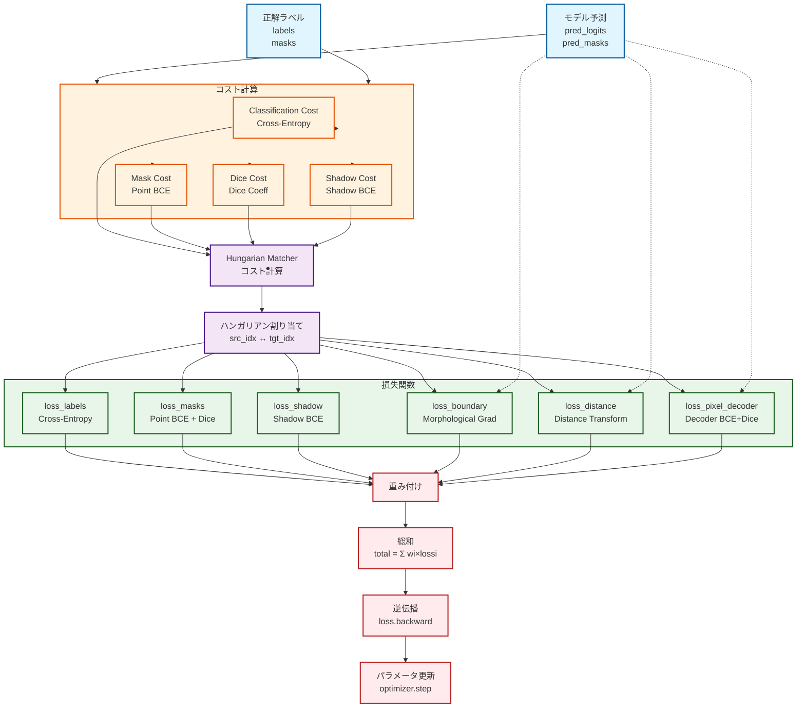
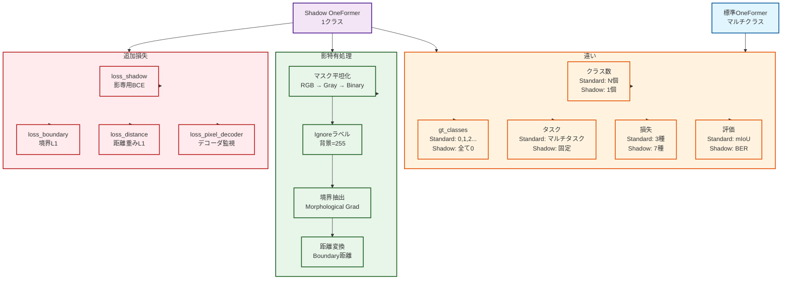
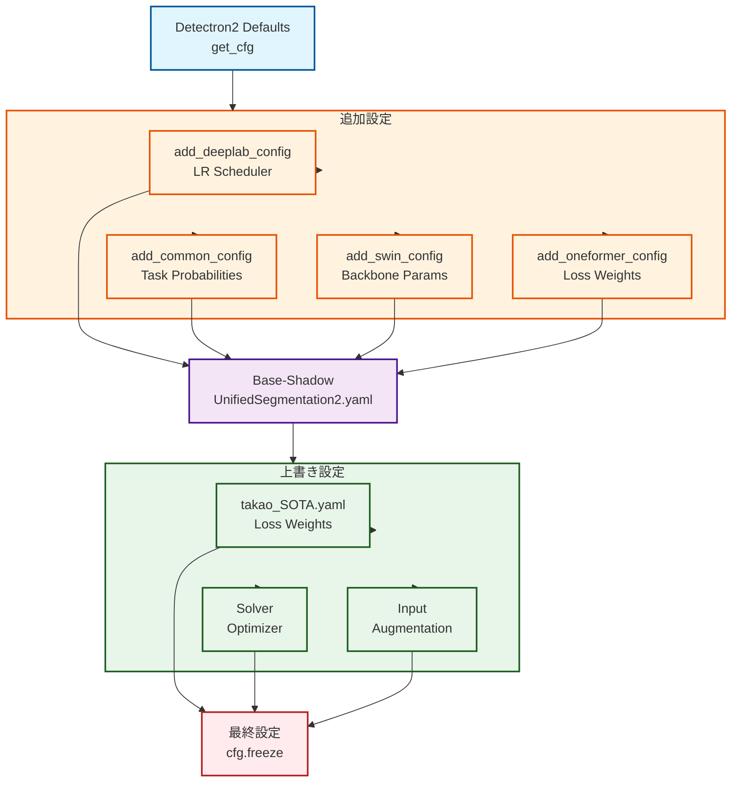

# OneShadowFormer Flowcharts

This document contains comprehensive flowcharts for the OneShadowFormer training pipeline.

## Main Training Flow

```mermaid
flowchart TD
    START([開始<br/>train_net.py])
    CFG1[設定ファイル読み込み<br/>takao_SOTA.yaml]
    CFG2[コンフィグ構築<br/>add_common_config<br/>add_oneformer_config<br/>add_swin_config]
    REG[データセット登録<br/>register_shadow_dataset]
    INIT[Trainer初期化]
    DATA[データローダー構築<br/>OneFormerUnifiedDatasetMapper]
    MODEL[モデル構築<br/>OneFormer]
    OPT[オプティマイザー構築<br/>AdamW]
    LOOP{訓練ループ<br/>MAX_ITER=45000}

    subgraph BATCH["ミニバッチ処理"]
        LOAD1[画像を読み込み<br/>512×512]
        LOAD2[マスクを読み込み<br/>Binary mask]
        AUG[データ拡張<br/>Resize, Crop, Flip]
        NORM[正規化<br/>(x - mean) / std]
        PAD[パディング<br/>size_divisibility=512]
    end

    FWD[順伝播<br/>Backbone → Decoder]
    LOSS[損失計算<br/>Hungarian Matching]
    BACK[逆伝播<br/>loss.backward]
    STEP[オプティマイザ更新<br/>optimizer.step]
    CHECK{チェックポイント<br/>5000回毎}
    SAVE[モデル保存]
    EVAL[評価<br/>ShadowEvaluator]
    LOG[ログ出力<br/>WandB]

    END([終了])

    START --> CFG1 --> CFG2 --> REG --> INIT --> DATA --> MODEL --> OPT --> LOOP
    LOOP --> BATCH
    BATCH --> LOAD1 --> LOAD2 --> AUG --> NORM --> PAD
    PAD --> FWD --> LOSS --> BACK --> STEP --> LOOP
    LOOP --> CHECK
    CHECK -->|Yes| SAVE --> EVAL --> LOG --> LOOP
    CHECK -->|No| LOOP
    LOOP -->|完了| END

    classDef startStyle fill:#c8e6c9,stroke:#1b5e20,stroke-width:3px
    classDef configStyle fill:#e1f5fe,stroke:#01579b,stroke-width:2px
    classDef dataStyle fill:#fff3e0,stroke:#e65100,stroke-width:2px
    classDef modelStyle fill:#f3e5f5,stroke:#4a148c,stroke-width:2px
    classDef trainStyle fill:#ffebee,stroke:#b71c1c,stroke-width:2px
    classDef evalStyle fill:#fce4ec,stroke:#c2185b,stroke-width:2px

    class START,END startStyle
    class CFG1,CFG2,REG,INIT configStyle
    class DATA,MODEL,OPT modelStyle
    class BATCH,LOAD1,LOAD2,AUG,NORM,PAD dataStyle
    class FWD,LOSS,BACK,STEP trainStyle
    class SAVE,EVAL,LOG,eval evalStyle
```

## Data Processing Flow

```mermaid
flowchart TD
    RAW[SOBAデータセット<br/>Raw Input]
    IMG{画像ファイル?}
    MASK{マスクファイル?}

    subgraph IMAGE_PROCESS["画像処理"]
        READ1[imread<br/>RGB形式]
        RESIZE1[ResizeShortestEdge<br/>512px]
        CROP[RandomCrop<br/>512×512]
        FLIP[RandomFlip<br/>確率50%]
        TOTENSOR[Tensor変換<br/>H×W×3 → 3×H×W]
        NORMIMG[正規化<br/>(x-127.5)/127.5]
        PADIMG[パディング<br/>512の倍数]
    end

    subgraph MASK_PROCESS["マスク処理"]
        READ2[imread<br/>グレースケール]
        BINARIZE[2値化<br/>pixel > 10 → 1]
        FLATTEN[フラット化<br/>C>1 → max axis=-1]
        RESIZE2[Resize<br/>512×512]
        IGNORE[Ignoreラベル設定<br/>背景=255]
        PADMASK[パディング<br/>値=0]
    end

    subgraph INSTANCE["インスタンス生成"]
        EXTRACT[影領域抽出<br/>mask == 1]
        CREATE[Instances作成]
        CLASS[クラス設定<br/>全て0（影）]
        BOX[バウンディングボックス<br/>プレースホルダー]
    end

    subgraph FINAL["最終データ"]
        BATCH[バッチ化<br/>B×3×512×512]
        TASK[タスクトークン<br/>"The task is shadow"]
        LABEL[セマンティックラベル<br/>512×512]
    end

    RAW --> IMG
    RAW --> MASK

    IMG -->|Yes| IMAGE_PROCESS
    MASK -->|Yes| MASK_PROCESS

    IMAGE_PROCESS --> READ1 --> RESIZE1 --> CROP --> FLIP --> TOTENSOR --> NORMIMG --> PADIMG
    MASK_PROCESS --> READ2 --> BINARIZE --> FLATTEN --> RESIZE2 --> IGNORE --> PADMASK

    PADIMG --> BATCH
    PADMASK --> INSTANCE
    INSTANCE --> EXTRACT --> CREATE --> CLASS --> BOX

    BATCH --> FINAL
    TASK --> FINAL
    CLASS --> FINAL
    LABEL --> FINAL

    classDef inputStyle fill:#e1f5fe,stroke:#01579b,stroke-width:2px
    classDef imageStyle fill:#fff3e0,stroke:#e65100,stroke-width:2px
    classDef maskStyle fill:#f3e5f5,stroke:#4a148c,stroke-width:2px
    classDef instStyle fill:#e8f5e9,stroke:#1b5e20,stroke-width:2px
    classDef finalStyle fill:#ffebee,stroke:#b71c1c,stroke-width:2px

    class RAW,IMG,MASK inputStyle
    class READ1,RESIZE1,CROP,FLIP,TOTENSOR,NORMIMG,PADIMG imageStyle
    class READ2,BINARIZE,FLATTEN,RESIZE2,IGNORE,PADMASK maskStyle
    class EXTRACT,CREATE,CLASS,BOX instStyle
    class BATCH,TASK,LABEL,FINAL finalStyle
```

## Model Forward Pass

```mermaid
flowchart LR
    INPUT[入力<br/>B×3×H×W]
    TASK[タスク<br/>"The task is shadow"]

    subgraph BACK["Backbone<br/>Swin Transformer"]
        S1[Stage1<br/>res2<br/>B×96×H/4×W/4]
        S2[Stage2<br/>res3<br/>B×192×H/8×W/8]
        S3[Stage3<br/>res4<br/>B×384×H/16×W/16]
        S4[Stage4<br/>res5<br/>B×768×H/32×W/32]
    end

    subgraph PIXEL["Pixel Decoder"]
        P1[Projection<br/>各レイヤー→256ch]
        P2[MSDeformAttn<br/>マルチスケール融合]
        P3[Pixel Features<br/>B×256×H/4×W/4]
    end

    subgraph DEC["Transformer Decoder<br/>6層"]
        Q1[Object Queries<br/>120ベクトル]
        LAYER[Layer 1~6]
        SELF[Self-Attention<br/>Q@K@V]
        CROSS[Cross-Attention<br/>Q@PixelFeatures]
        FFN[FFN + Mask Prediction]
    end

    subgraph HEAD["Prediction Heads"]
        CLS[Classification Head<br/>120 → 2クラス]
        MSK[Mask Head<br/>120 → H/4×W/4]
    end

    subgraph OUT["出力"]
        LOGITS[pred_logits<br/>B×120×2]
        MASKS[pred_masks<br/>B×120×H/4×W/4]
        AUX[aux_outputs<br/>5層分]
    end

    INPUT --> BACK
    TASK -.->|MLP| DEC

    BACK --> S1 --> S2 --> S3 --> S4
    S2 -.-> P1
    S3 -.-> P1
    S4 -.-> P1

    P1 --> P2 --> P3

    Q1 --> LAYER
    P3 -.->|Memory| LAYER
    TASK -.->|Task Token| LAYER

    LAYER --> SELF --> CROSS --> FFN
    FFN -.->|次の層へ| LAYER

    FFN --> HEAD
    CLS --> LOGITS
    MSK --> MASKS
    LAYER -.->|Aux| AUX

    classDef inputStyle fill:#e1f5fe,stroke:#01579b,stroke-width:2px
    classDef backboneStyle fill:#fff3e0,stroke:#e65100,stroke-width:2px
    classDef pixelStyle fill:#f3e5f5,stroke:#4a148c,stroke-width:2px
    classDef decoderStyle fill:#e8f5e9,stroke:#1b5e20,stroke-width:2px
    classDef headStyle fill:#ffebee,stroke:#b71c1c,stroke-width:2px
    classDef outputStyle fill:#fce4ec,stroke:#c2185b,stroke-width:2px

    class INPUT,TASK inputStyle
    class BACK,S1,S2,S3,S4 backboneStyle
    class PIXEL,P1,P2,P3 pixelStyle
    class DEC,Q1,LAYER,SELF,CROSS,FFN decoderStyle
    class HEAD,CLS,MSK headStyle
    class OUT,LOGITS,MASKS,AUX outputStyle
```

## Loss Computation Flow



## Evaluation Flow

```mermaid
flowchart TD
    START([評価開始])
    LOAD[テストデータ読み込み]
    MODEL[モデルロード<br/>checkpoint.pth]
    NO_GRAD[torch.no_grad]

    subgraph INFER["推論"]
        FWD[順伝播<br/>model.forward]
        POST[後処理<br/>sigmoid + argmax]
        BINARY[2値化<br/>prob > 0.5]
    end

    subgraph METRICS["メトリクス計算"]
        CMP[予測 vs 正解<br/>pixel-wise比較]
        TP[True Positive<br/>pred=1 & gt=1]
        TN[True Negative<br/>pred=0 & gt=0]
        FP[False Positive<br/>pred=1 & gt=0]
        FN[False Negative<br/>pred=0 & gt=1]
    end

    subgraph CALC["計算"]
        PREC[精度<br/>TP/(TP+FP)]
        REC[再現率<br/>TP/(TP+FN)]
        F1[F値<br/>2×P×R/(P+R)]
        BER[Balanced Error Rate<br/>0.5×(1-prec+1-rec)×100]
    end

    subgraph OUTPUT["出力"]
        LOG[ログ出力<br/>console]
        JSON[JSON出力<br/>metrics.json]
        VIS[可視化<br/>input|gt|pred]
        HIGH[高BER画像保存<br/>分析用]
    end

    END([終了])

    START --> LOAD --> MODEL --> NO_GRAD --> INFER
    INFER --> FWD --> POST --> BINARY
    BINARY --> METRICS
    METRICS --> CMP
    CMP --> TP
    CMP --> TN
    CMP --> FP
    CMP --> FN

    TP --> CALC
    TN --> CALC
    FP --> CALC
    FN --> CALC

    CALC --> PREC
    CALC --> REC
    CALC --> F1
    CALC --> BER

    PREC --> OUTPUT
    REC --> OUTPUT
    F1 --> OUTPUT
    BER --> OUTPUT

    OUTPUT --> LOG
    OUTPUT --> JSON
    OUTPUT --> VIS
    OUTPUT --> HIGH

    HIGH --> END
    LOG --> END
    JSON --> END
    VIS --> END

    classDef startStyle fill:#c8e6c9,stroke:#1b5e20,stroke-width:3px
    classDef inferStyle fill:#e1f5fe,stroke:#01579b,stroke-width:2px
    classDef metricsStyle fill:#fff3e0,stroke:#e65100,stroke-width:2px
    classDef calcStyle fill:#f3e5f5,stroke:#4a148c,stroke-width:2px
    classDef outputStyle fill:#e8f5e9,stroke:#1b5e20,stroke-width:2px

    class START,END startStyle
    class INFER,FWD,POST,BINARY inferStyle
    class METRICS,CMP,TP,TN,FP,FN metricsStyle
    class CALC,PREC,REC,F1,BER calcStyle
    class OUTPUT,LOG,JSON,VIS,HIGH outputStyle
```

## Shadow-Specific Processing



## Configuration Flow


